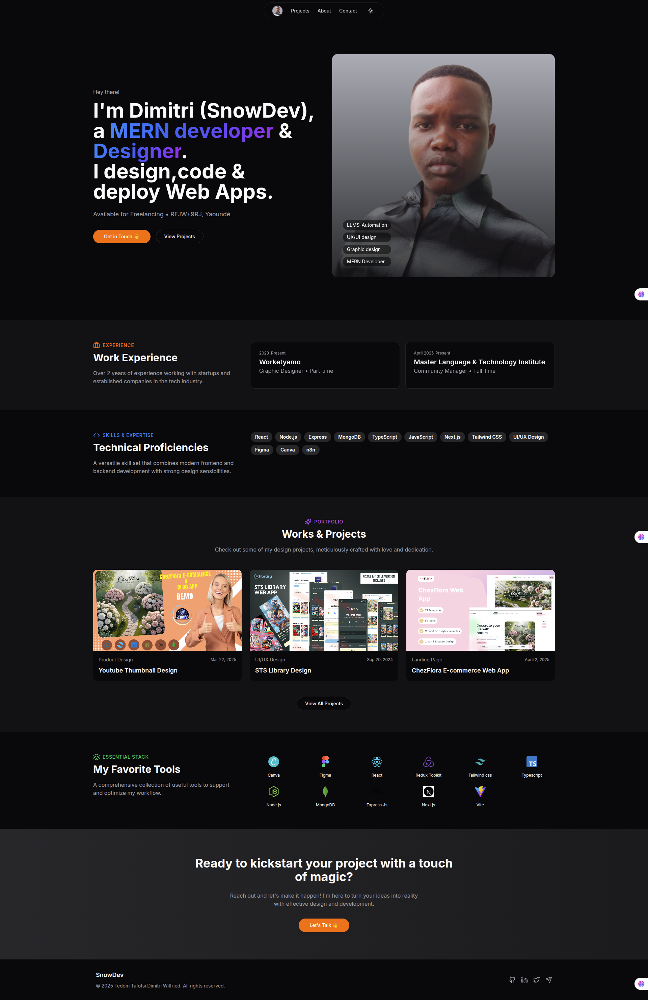

# Developer & Designer Portfolio



## 👋 Welcome

Welcome to my professional portfolio repository! I'm a multidisciplinary developer and designer specializing in web applications, UI/UX design, and educational content creation. This repository contains the code for my personal portfolio website, showcasing my projects and skills.

## 🚀 Project Overview

This portfolio is built with React and TypeScript, using modern web development practices and a responsive design approach. It features:

- Responsive layout for all device sizes
- Dark/light theme support
- Interactive project gallery
- Detailed project case studies
- Contact form integration

## 💻 Technology Stack

- **Frontend Framework**: React 18 with TypeScript
- **Routing**: React Router DOM
- **Styling**: Tailwind CSS with shadcn/ui components
- **Animations**: Framer Motion
- **State Management**: React Query
- **Form Handling**: React Hook Form with Zod validation
- **Build Tool**: Vite
- **Deployment**: Netlify

## 🎨 Featured Projects

### Educational Content

- **THE ULTIMATE CANVA PRO COURSE**: A comprehensive 20+ hour video course with 15 projects teaching design skills with traditional and AI-assisted approaches. Created for beginners to build professional-level design capabilities in Canva Pro.

### E-commerce & Web Applications

- **ChezFlora E-commerce Web App**: Award-winning e-commerce platform developed within a tight 1-month timeline, featuring user role-based authentication and real-time data visualization. This project won 1st place in a competitive challenge.

- **Snow Brain AI**: A Gemini-powered chatbot with real-time multimodal reasoning capabilities, featuring fast response times and high user satisfaction rates (92% satisfaction with 10,000+ daily queries).

- **Client Portfolio**: A responsive portfolio website developed in just 48 hours for a client, featuring EmailJS integration and interactive animations that resulted in multiple interview opportunities for the client.

### UI/UX Design Projects

- **ChezFlora Design System**: A comprehensive design system created in 5 days, featuring auto layout components, color & text variables, and interactive prototypes that reduced development implementation time by 40%.

- **STS Library Design**: A 3-day design sprint creating a visually striking interface for a digital library, incorporating advanced color theory and animations that improved task completion by 30%.

### Educational Tools & Mini-Applications

- **STS Password Generator**: A security tool creating strong passwords with customizable parameters and visual strength indicators.

- **STS Coin Flip Game**: An interactive web application with realistic 3D coin animations, showcasing advanced CSS transformations and physics-based animations.

- **STS Tech Stickers Generator**: A creative web app generating randomized tech-themed stickers with visually appealing designs using color harmony algorithms.

## 🛠️ Technical Skills

### Development
- HTML5, CSS3, JavaScript/TypeScript
- React.js, Next.js, Redux
- Tailwind CSS, Framer Motion
- Node.js, Express
- REST APIs integration

### Design
- UI/UX Design, Design Systems
- Figma, Canva Pro
- Responsive Web Design
- Animation & Interaction Design
- Color Theory & Typography

### Educational Content Creation
- Video Production & Editing
- Course Structure & Curriculum Design
- Traditional & AI-assisted Design Teaching
- Educational Resource Development

## 🚀 Getting Started

### Prerequisites
- Node.js (v16+)
- npm or yarn

### Installation

1. **Clone the repository:**
   ```bash
   git clone https://github.com/DimitriTedom/snow-dev-portfolio.git
   ```
2. **Navigate to the project directory:**
   ```bash
   cd snow-dev-portfolio
   ```
3. **Install dependencies:**
   ```bash
   npm install
   # or
   yarn install
   ```

### Development

- **Start the development server:**
  ```bash
  npm run dev
  # or
  yarn dev
  ```
  Open [http://localhost:3000](http://localhost:3000) in your browser to view the app.

### Production Build

- **Build for production:**
  ```bash
  npm run build
  # or
  yarn build
  ```
- **Preview production build locally:**
  ```bash
  npm run preview
  # or
  yarn preview
  ```

### Deployment

This site is deployed on Netlify. To deploy your own fork:

1. Create a new site on Netlify and connect your GitHub repository.
2. Set the build command to:
   ```bash
   npm run build
   ```
3. Set the publish directory to:
   ```bash
   dist
   ```
4. Enable continuous deployment to automatically redeploy on each push.

## 📝 Contributing

Contributions are welcome! To contribute:

1. Fork the repository.
2. Create a new branch\`feature/your-feature\`.
3. Commit your changes.
4. Push to your branch.
5. Open a Pull Request describing your changes.

Please follow the established code style and include meaningful commit messages.

## 📄 License

Distributed under the MIT License. See [LICENSE](LICENSE) for more information.

## 📞 Contact

- **Website:** [https://trionn.com](https://trionn.com)
- **Email:** dimitritedom@gmail.com
- **GitHub:** [DimitriTedom](https://github.com/DimitriTedom)