```mermaid
graph LR
    A[🎯 Research] --> B[🎨 Design in Figma]
    B --> C[🛠️ Prototype]
    C --> D[💻 Develop with React/Node]
    D --> E[☁️ Deploy on AWS]
    E --> F[📊 Monitor & Optimize]
    F --> A
    
    style A fill:#667eea,stroke:#333,stroke-width:2px,color:#fff
    style B fill:#764ba2,stroke:#333,stroke-width:2px,color:#fff
    style C fill:#667eea,stroke:#333,stroke-width:2px,color:#fff
    style D fill:#764ba2,stroke:#333,stroke-width:2px,color:#fff
    style E fill:#667eea,stroke:#333,stroke-width:2px,color:#fff
    style F fill:#764ba2,stroke:#333,stroke-width:2px,color:#fff
```

# Hi there! 👋 I'm Dimitri (SnowDev)

<div align="center">
  
</div>

<div align="center">
  
</div>

<div align="center">
  
  [](https://visitorbadge.io/status?path=DimitriTedom)
  [](https://github.com/DimitriTedom)
  
</div>

---

## 🚀 About Me

I'm a passionate **Full Stack JavaScript Developer**, **UI/UX Designer**, and **Graphic Design Expert** with **2+ years of mastery** crafting cutting-edge digital experiences. Based in **🇨🇲 Cameroon, Yaoundé**, I specialize in architecting, designing, and deploying enterprise-grade web applications using the latest technologies.

My unique approach seamlessly blends **full-stack development expertise** with **advanced design thinking**, creating solutions that are not only technically robust but also deliver exceptional user experiences across all touchpoints.

<div align="center">
  
</div>

### 🎯 Core Expertise
```typescript
const snowDev = {
  expertise: {
    fullStackDevelopment: ["React", "Node.js", "Express", "MongoDB", "TypeScript"],
    uiUxDesign: ["Figma", "FigJam", "Design Systems", "User Research"],
    graphicDesign: ["Canva Mastery (2+ years)", "Brand Identity", "Visual Design"],
    cloudArchitecture: ["AWS Solutions", "Infrastructure Design", "Scalability"],
    aiAutomation: ["n8n", "Workflow Optimization", "AI Integration"]
  },
  currentFocus: "Building the future of web experiences",
  availability: "Open for innovative projects"
};
```

## 💼 Professional Journey

<div align="center">

| Role | Company | Duration | Focus |
|------|---------|----------|-------|
| 🎨 **Graphic Designer** | **Worketyamo** | 2023-Present | Visual Brand Identity |
| 👥 **Community Manager** | **Master Language & Technology Institute** | April 2025-Present | Digital Engagement |
| ☁️ **AWS Architect** | **Upcoming Certification** | 2025 | Cloud Solutions |

</div>

## 🛠️ Technology Arsenal

<div align="center">

### 🚀 Full Stack Development


### 🗄️ Databases & State Management


### 🎨 Design & Creative Tools


### ☁️ Cloud & DevOps


### 🎯 Styling & Build Tools


### 🤖 AI & Automation


</div>

## 🏆 Featured Projects

### 🚀 Development Projects

#### **ChezFlora E-commerce Web App**
- **Award-winning** e-commerce platform (1st place in competitive challenge)
- Built in just **1 month** with user role-based authentication
- Real-time data visualization and responsive design
- **Tech Stack**: MERN, TypeScript, Tailwind CSS

#### **Snow Brain AI Chatbot**
- Gemini-powered chatbot with multimodal reasoning
- **92% user satisfaction** rate with **10,000+ daily queries**
- Real-time response capabilities
- **Tech Stack**: React, Node.js, Google Gemini API

#### **Client Portfolio (48h Challenge)**
- Responsive portfolio website built in **48 hours**
- EmailJS integration and interactive animations
- Resulted in multiple interview opportunities for client
- **Tech Stack**: React, TypeScript, Framer Motion

### 🎨 Design Projects

#### **ChezFlora Design System**
- Comprehensive design system created in **5 days**
- Auto layout components with Figma variables
- **40% reduction** in development implementation time
- Interactive prototypes across **8+ organized pages**

#### **STS Library Design**
- **3-day design sprint** for digital library interface
- Advanced color theory and animation implementation
- **30% improvement** in task completion rates

### 📚 Educational Content

#### **THE ULTIMATE CANVA PRO COURSE**
- **20+ hours** of comprehensive video content
- **15 distinct projects** from beginner to advanced
- Dual-track approach: traditional + AI-assisted design
- Created, produced, and marketed from scratch

## 🎓 Education & Certifications

### 📖 Education
- **GCE A-Levels** in Mathematics, Further Maths, Physics, Chemistry, and Biology
- **GBHS Mbalmayo** (2022-2023) - Graduated with honors

### 🏅 Certifications & Achievements

<div align="center">


</div>

| 🏆 Certification | 📚 Provider | ⏱️ Duration | 📅 Status |
|---|---|---|---|
| **Figma Essential for UI/UX Design** | Udemy | 4 hrs | ✅ Completed |
| **React: All You Need to Know** | Udemy | 11 hrs | ✅ Completed |
| **Canva Mastery (200+ Designs)** | Canva | 2+ years | ✅ Expert Level |
| **ChatGPT Master Course** | Udemy | 4.5 hrs | ✅ Completed |
| **Complete WordPress Developer** | Udemy | 5 hrs | ✅ Completed |
| **AWS Solutions Architect Associate** | AWS | In Progress | 🎯 2025 Target |

## 📊 GitHub Analytics

<div align="center">
  
  
</div>

<div align="center">
  
</div>

<div align="center">
  
</div>

## 🌐 Connect with Me

<div align="center">

```typescript
const connectWithSnowDev = {
  portfolio: "https://snowdev-portfolio.vercel.app",
  email: "dimitritedom@gmail.com",
  linkedin: "linkedin.com/in/dimitri-tedom",
  github: "github.com/DimitriTedom",
  availability: "Open for collaboration 🚀"
};
```

[](https://your-portfolio-url.com)
[](https://linkedin.com/in/your-linkedin)
[](https://twitter.com/your-twitter)
[](mailto:dimitritedom@gmail.com)
[](https://wa.me/your-number)

</div>

## 💡 Fun Facts & Achievements

<div align="center">

| � Metric | 📊 Achievement | 🚀 Impact |
|---|---|---|
| 🌍 **Location** | Yaoundé, Cameroon | Global Remote Ready |
| ⚡ **Experience** | 2+ Years Mastery | Full Stack + Design |
| 🎨 **Canva Designs** | 200+ Creations | Certified Expert |
| 🏆 **Competition Win** | 1st Place | Development Challenge |
| 📚 **Content Created** | 20+ Hours | Educational Impact |
| ☁️ **AWS Journey** | In Progress | Cloud Architecture |

</div>

## 🔥 Current Mission & Vision

<div align="center">

```yaml
snowDev_2025_roadmap:
  mission: "Architecting the future of web experiences"
  
  current_focus:
    - name: "Next-Gen Full Stack Applications"
      tech: ["React 18+", "Node.js", "TypeScript", "AWS"]
      impact: "Scalable, performant, user-centric"
    
    - name: "Advanced Design Systems"
      tools: ["Figma", "FigJam", "Design Tokens"]
      outcome: "Seamless design-to-development workflow"
    
    - name: "AI-Powered Automation"
      platforms: ["n8n", "OpenAI", "Custom Workflows"]
      result: "Enhanced productivity & innovation"
    
    - name: "AWS Cloud Architecture"
      certification: "Solutions Architect Associate"
      timeline: "Q2 2025"
      
  vision: "Creating digital solutions that solve real-world problems"
  availability: "Open for innovative partnerships"
```

</div>

---

<div align="center">
  
### 🎯 Professional Philosophy
> *"Architecting digital experiences that seamlessly blend cutting-edge technology with intuitive design, creating solutions that don't just work—they inspire."*


**💼 Open for Collaboration** • **🚀 Available for Innovation** • **🌟 Ready to Build the Future**


</div>

---

<details>
<summary>📈 Detailed GitHub Analytics</summary>
<br>

<div align="center">


### 📊 Coding Time Breakdown


### 🎯 Most Used Languages (Detailed)


</div>

</details>

<details>
<summary>🎨 Design & Development Workflow</summary>
<br>



</details>